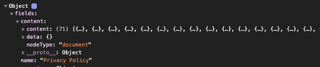

#How to parse / format Contentful rich text in React

When building an app or platform, 100% recommend integrating a cms and Contentful is a solid option. This starts out great for simple text fields and the response is straightforward and easy to use and you have a schema to align on across your app. (Code examples only show few fields)

```javascript
{
  content: {
    fields: {
      title: 'Site Title';
    }
    sys: {
      id: '1234';
    }
  }
}
```

But next we need blog posts, privacy policy, terms of service and this longer text of course hase to be formatted. You could make "paragraph1", "paragraph2" and have multiple simple text and this is straightforward, but tedious. Enter the Contentful rich text field type you can add to your content and now we have a problem. How do we take this nested output and render it out with the expected formatting.



<br/>
Searching the docs you might find the answer:

@contentful/rich-text-react-renderer

```javascript
import { documentToReactComponents } from '@contentful/rich-text-react-renderer';
```

So you drop it in

```javascript
documentToReactComponents(content);
```

And then we get one long unformatted text blob. The missing piece is the 2nd argument, you can pass options in to this method.

```javascript
documentToReactComponents(content, options);
```

And then for options what we really need is to add another library and import the types, so that we can add styling per "type" - Paragraph, UL_LIST, etc etc

```javascript
import { BLOCKS, MARKS, INLINES } from '@contentful/rich-text-types';
```

And now we can bake this cake! Mock code here, of an example of options and putting it all together.

```javascript
import { documentToReactComponents } from '@contentful/rich-text-react-renderer';
import { BLOCKS, MARKS, INLINES } from '@contentful/rich-text-types';

const options = {
  renderNode: {
    [BLOCKS.PARAGRAPH]: (node, children) => (
      <p
        style={{
          color: theme.colors.darkBlue,
          fontFamily: theme.fonts.Century_Gothic,
          fontSize: '15px',
          lineHeight: '30px',
          marginBottom: '0.75rem',
        }}
      >
        {children}
      </p>
    ),
    [BLOCKS.UL_LIST]: (node, children) => {
      return (
        <ul
          style={{
            listStyle: 'disc',
            color: theme.colors.darkBlue,
            fontFamily: theme.fonts.Century_Gothic,
            fontSize: '15px',
            lineHeight: '30px',
            marginLeft: '1rem',
          }}
        >
          {children.map((item) => (
            <li key={item.key}>{item.props.children[0].props.children[0]}</li>
          ))}
        </ul>
      );
    },

    [INLINES.HYPERLINK]: (node, children) => {
      return (
        <a
          href={node.data.uri}
          target="_blank"
          rel="noopener noreferrer"
          style={{ color: theme.colors.darkBlue }}
        >
          {children}
        </a>
      );
    },
  },
};

documentToReactComponents(content, options);
```

Example here is rough and has inline styling, but can use classNames etc etc, the caveat is that you might need to tweak the formatting in Contentful and go back and forth, as if you copy paste massive content into the editor and then try and display it you can find some inconsistencies, so you do need to do some of the structure and formatting work inside of the contentful rich text editor and you can't quite copy paste a word document in there.

Found this wasn't documented very clearly, and wanted to share what is working at the moment. But any tips or tricks please share!

Happy Coding!
