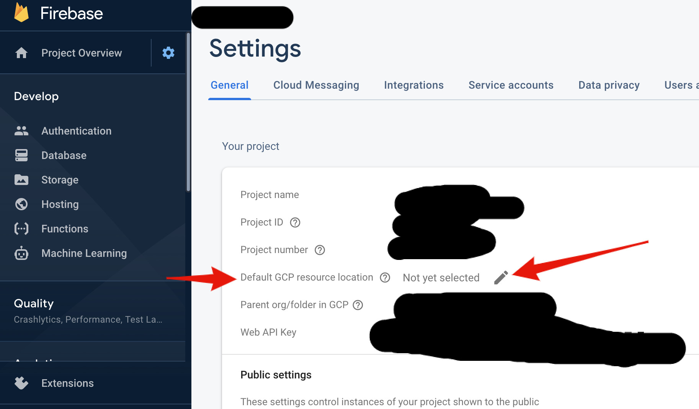
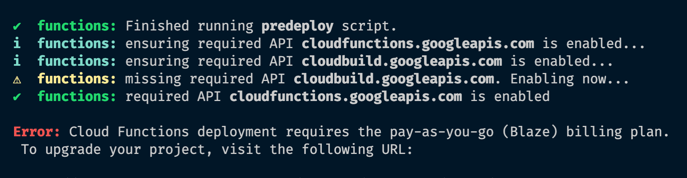

#Firebase Region Not Set?!

When deploying firebase functions, you might hit this error "Error: Cloud resource location is not set" and to their credit the command line will show a link to their docs, but it is at the very bottom of the page and i get this question a lot. Just gotta go to settings in the firebase console and choose a region, I tend to choose "us-central1", but can check out all the [available regions and locations](https://firebase.google.com/docs/functions/locations)

 
Similarly you might hit an error when deploying functions saying you have to upgrade to a blaze plan, fear not this is just gcp asking you to put a card in place in the event you end up hosting the next twitter or such. Also bonus now you can turn on nightly backups of the realtime database. (go to realtime db ui and click backups tab )

  
Even if the card in place scares you a bit, the free tier still applies and i don't think there is a better value for free tiers than firebase/gcp. I really am becoming unofficial gcp dev rel over here.

Image by <a href="https://pixabay.com/users/Buddy_Nath-2005766/?utm_source=link-attribution&amp;utm_medium=referral&amp;utm_campaign=image&amp;utm_content=2621330">A Owen</a> from <a href="https://pixabay.com/?utm_source=link-attribution&amp;utm_medium=referral&amp;utm_campaign=image&amp;utm_content=2621330">Pixabay</a>
