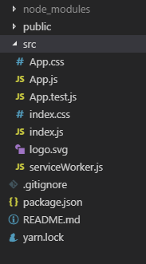
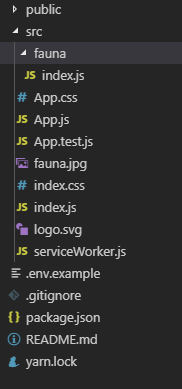
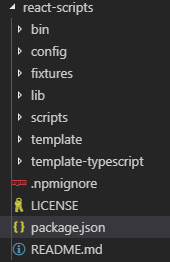
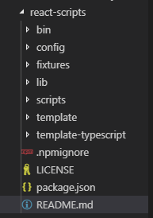
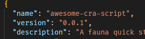

Few months back I learned of a new database ( [FaunaDB](https://docs.fauna.com/fauna/current/introduction) ) that captured my imagination. Native support for GraphQL with a flexible data model: relational, document or graph. Excited to try it out I kept spinning up [`create-react-app`](https://github.com/facebook/create-react-app) to make different projects trying out Fauna. I was copy pasting the same CRUD functions that I had written over and over to reuse in each new project. Then attending a [useReactNYC](https://usereact.nyc/) meetup, [Monica's](https://twitter.com/waterproofheart) talk on saving time using [Plop JS](https://plopjs.com/) and other tools came at a perfect time! Instead of copy pasting the same files/folders over and over for each new route or feature. You can run a command in your CLI, answer a few (or many) questions and add files or folder structure to your project. Generate whatever you want. This was a revelation.

```javascript
npm run plop
// What shall we call the new feature?
Team
```

Boom a new folder named Team with your css styles, layout boilerplate, your index file for exporting, maybe a Team.js file with some of your functions/dependencies imported ready to use. And off you go.

```javascript
import React, { Component } from 'react';
import { connect } from 'react-redux';
import { NavLink } from '../components/NavLink';
import SideBar from '../components/SideBar';
import SignIn from '../components/SignIn';
import styles from './styles.module.css';
import { signOut } from '../actions';
import HelpingImage from '../assets/helping.png';
import DownArrow from '../assets/ARROW-DOWN.svg';
```

This is just one hypothetical folder and files I made up. You can set up more questions, customize the folders and file output to match whatever you and your team uses.

Excited to save time and reuse my Fauna functions I set up plop to generate a Fauna boilerplate file for me with some reusable functions:

```javascript
const addNewCollection = async (newCollection: string) => {
  try {
    const ret = await client.query(q.CreateCollection({ name: newCollection }));
    return ret;
  } catch (err) {
    return console.error(err);
  }
};
```

https://github.com/NickFoden/fauna-plop

This worked great, but was the wrong move. Plop makes more sense to me when you can use it over and over in the same project, really great tool to aid teams in consistency with naming and folder structure.

What I realized I really wanted to do was to be able to spin up a new React App with Fauna already integrated into the project. Instead of having to install and run plop or copy paste my boilerplate Fauna files.

[`create-react-app`](https://github.com/facebook/create-react-app) is the one line command de facto start a react project CLI tool. I jumped into the issues, the repo, stack overflow, looking at ways to customize CRA to include `faunadb` as dependency and add some of my own files to the initial structure template:


<br/>
<br/>

It didn’t make sense to me to maintain a repo that would be a copy of the CRA full project and potentially miss out on all the features and fixes that the React team works so hard on. I focused on the Script package within CRA and modified this to add my fauna file with all my functions to the resulting project structure.


<br/>
<br/>

https://www.npmjs.com/package/fauna-nf

My fauna file is made up of the functions I find myself reusing over and over for projects. Create a new collection, create a new instance in a collection, delete an item, etc. This was a lot of fun and if you find yourself copy pasting the same code into each new CRA project or removing files/ reorganizing the structure you want to start with then good news you can also customize the CRA scripts package.

Fork https://github.com/facebook/create-react-app

`cd` into `packages`

`cd` into `react-scripts`

In here `create-react-app\packages\react-scripts` you will find a template and a template-typescript folder along with a README.md and package.json. `cd` into this `react-scripts` folder.



The template folder contains what the resulting file structure will look like after CRA runs and the template-typescript will contain, yeah you guessed it the resulting file structure if you run with typescript flag.

You could remove the default CRA logo, app.css etc change however you want to be your ideal structure for CRA. For me I just wanted the folder and file with my Fauna functions and then integrated a few lines at top of App.js so anyone using this has a quick start to get going with Fauna right away, uncomment and off you go.

```javascript
import React from 'react';
// A few general fauna methods ready for use
// import {
//   addNewCollection,
//   addSingleRecord,
```

<br/>
Also customize the package.json and the README.md inside this `react-scripts` folder so you can publish your "new" script to npm. The README.md will be the content for your scripts npm page. 
<br/>


<br/>
<br/>
Ensure a unique name for npm and also proper semver for your version number so you can have clear updates/releases.


<br/>
<br/>
And then in command line inside this react-scripts folder you are ready to publish.

`Npm login`<br/>`Npm publish`

Boom. Your own script to append to CRA and customize the folder output. If you updated the template-typescript folder as well then `--typescript` will work for that. Now you can run your "awesome-cra-script" appended after the default CRA and after `--scripts-version`

`create-react-app new-app-name --scripts-version awesome-cra-script`

Or ts:

`create-react-app new-app-name --scripts-version awesome-cra-script --typescript`

If you publish one holler at me! Love to see it. Hardest part might be coming up with the name for NPM. . .
